# Flowcharts - Issue Tracker

The whole system as diagrams. One page, no long explanations.

---

**1. System overview** - who talks to what.

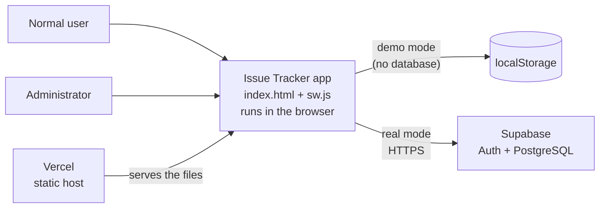

---

**2. Layers** - each layer only knows the one below it.

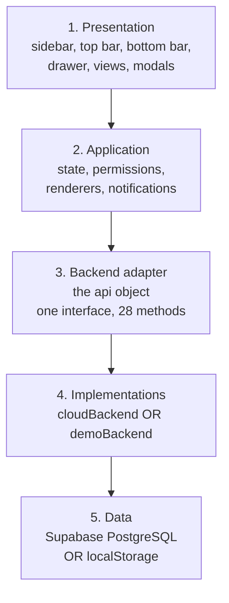

---

**3. Data model** - four tables.

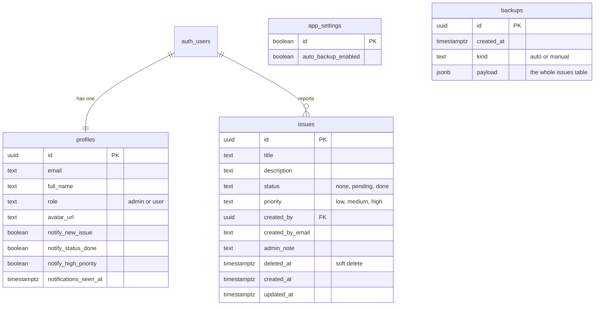

---

**4. Roles and what each can do.**

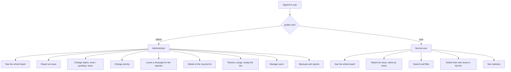

---

**5. Issue lifecycle** - the three statuses.

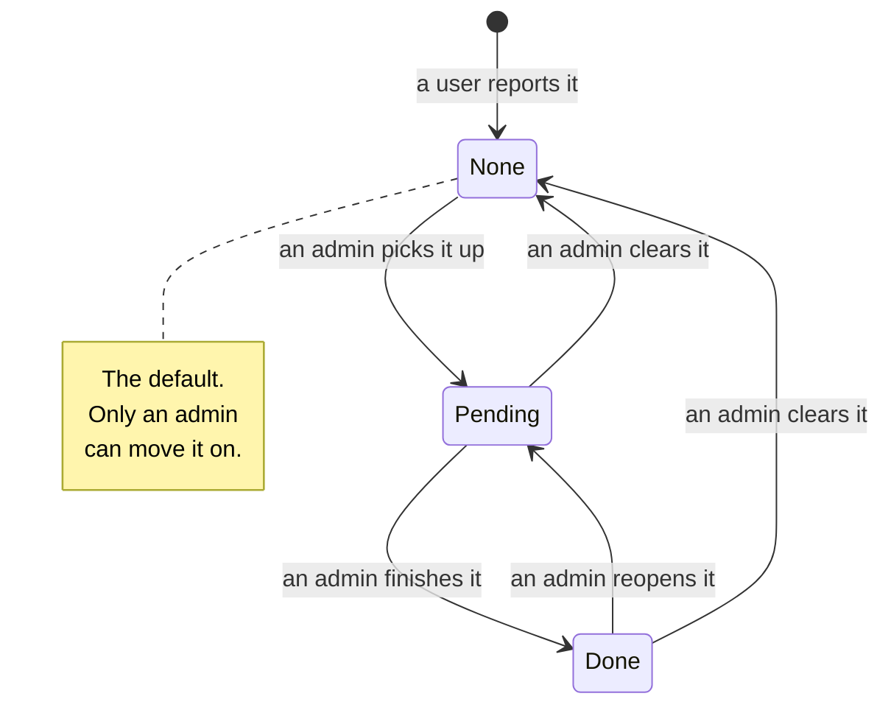

---

**6. Boot / startup** - opening the app.

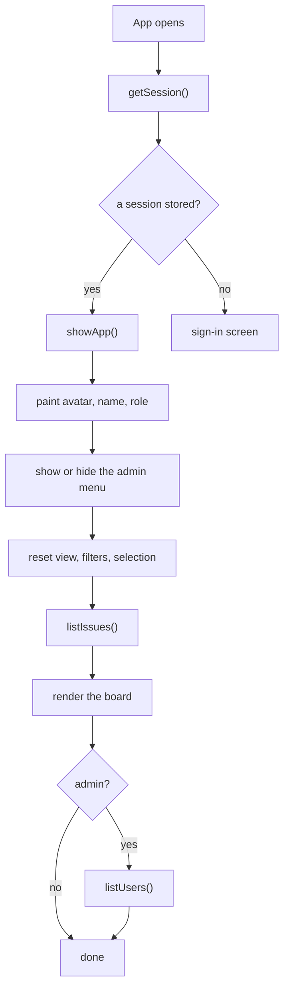

---

**7. Register** - and how the role is set.

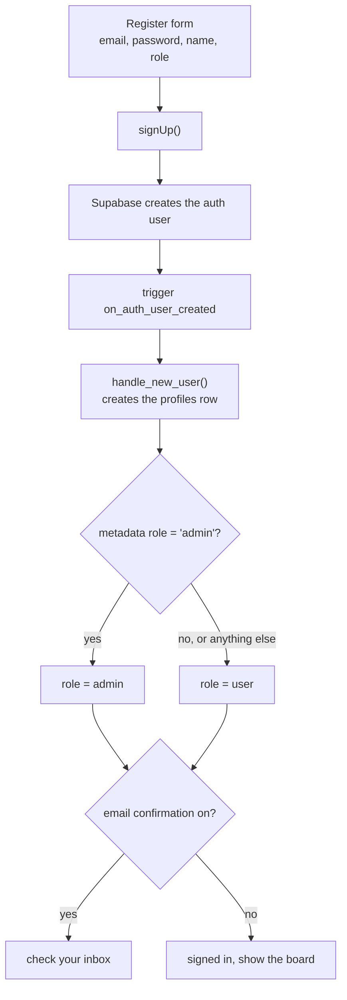

---

**8. Sign in and sign out.**

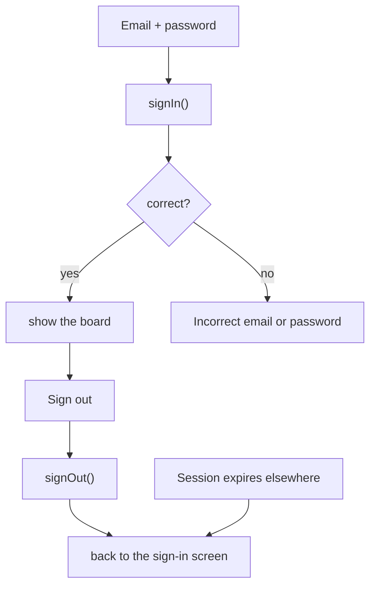

---

**9. Password reset.**

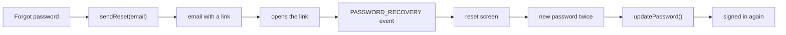

---

**10. Report an issue.**

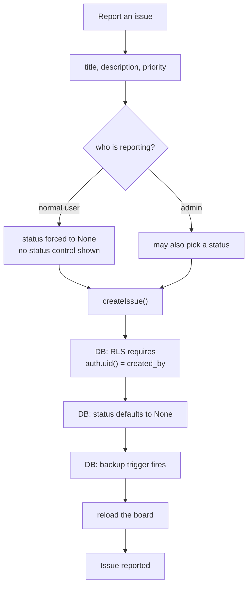

---

**11. Edit an issue and change status.**

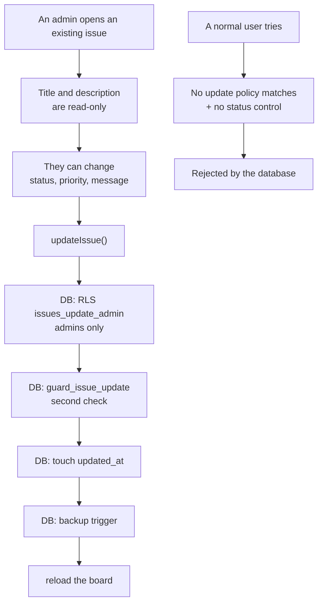

---

**12. Delete, recycle bin, restore, purge.**

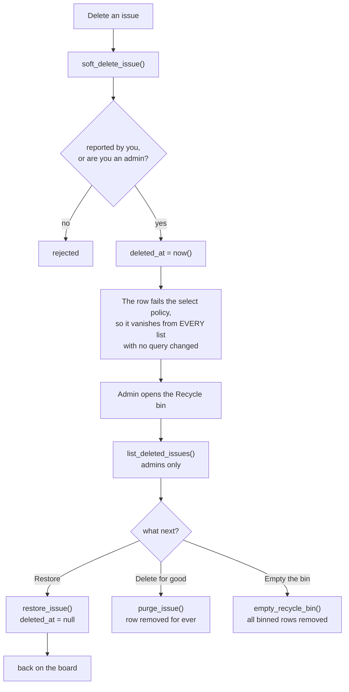

---

**13. Permission enforcement** - the same rule, three times.

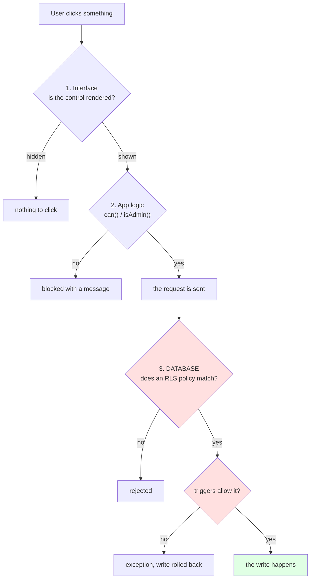

> Only step 3 is a real security boundary. Steps 1 and 2 just keep the
> interface honest.

---

**14. Automatic backups** - done by the database, not the browser.

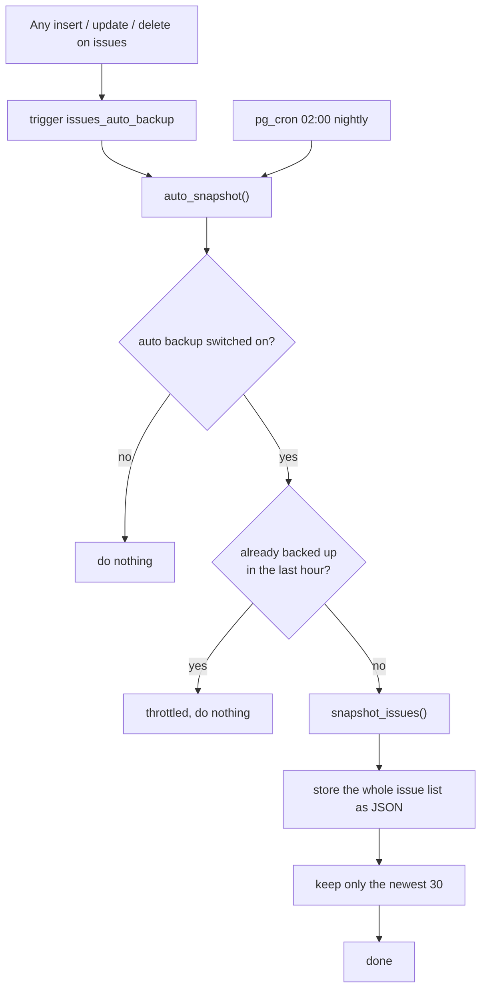

---

**15. Manual backup and restore.**

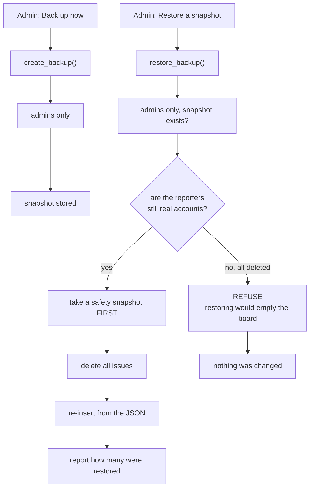

---

**16. Notifications** - the in-app bell, and the device notification.

```mermaid
flowchart TD
    subgraph IN["In the app - the bell and the list"]
        A["issues[]"] --> B["for each issue"]
        B --> C["new issue reported"]
        B --> D["marked as done"]
        B --> E["high priority, still open"]
        B --> F["message from an admin"]
        C --> G["filter by the user's<br/>notification preferences"]
        D --> G
        E --> G
        F --> G
        G --> H["newest first"]
        H --> I["unread = newer than<br/>notifications_seen_at"]
        I --> J["badge on the bell"]
    end

    subgraph OUT["On the device - a real notification"]
        K["A change made by someone else"] --> L{"how does it arrive?"}
        L -- "connected" --> M["Supabase Realtime"]
        L -- "otherwise" --> N["poll every 15 seconds"]
        M --> O["refresh()"]
        N --> O
        O --> P["compare with what was on screen"]
        P --> Q{"did we cause it?"}
        Q -- "yes" --> R["stay quiet"]
        Q -- "no" --> S{"allowed, and switched on?"}
        S -- "no" --> T["in-app toast instead"]
        S -- "yes" --> U["service worker<br/>showNotification()"]
        U --> V["tapping it brings the app forward"]
    end
```

> The bell is in-app and always works. The device notification needs
> permission, asked for from Settings when the button is pressed.
>
> A notification reaches a **closed** app only from a server holding a push
> subscription. Nothing sends one yet - the service worker's `push` handler is
> in place for when that exists.

---

**17. What the database decides** - the rules that cannot be bypassed.

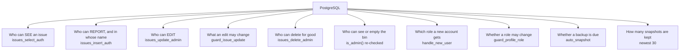

---

**18. Install and offline.**

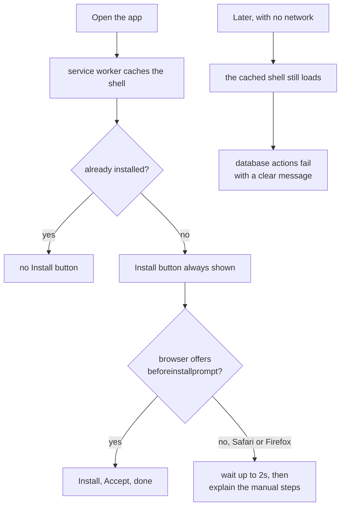

---

**19. Deployment.**

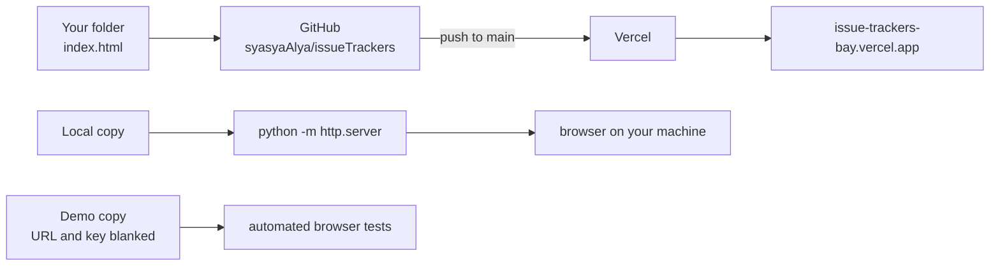
